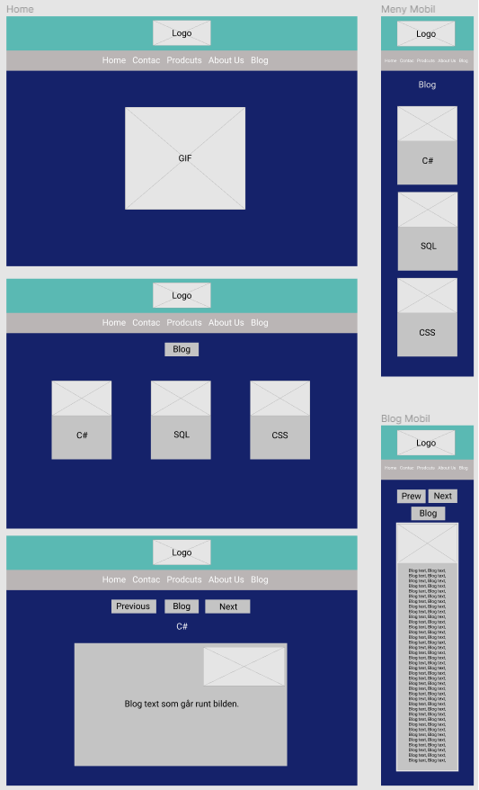
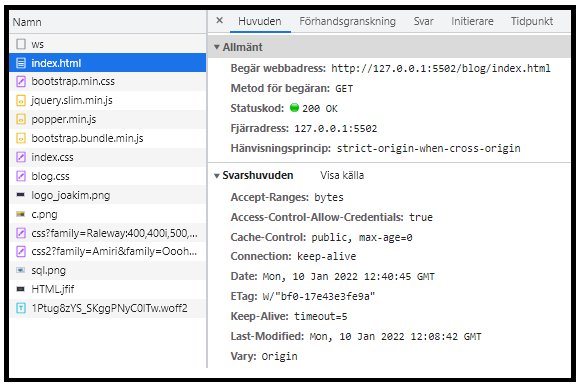
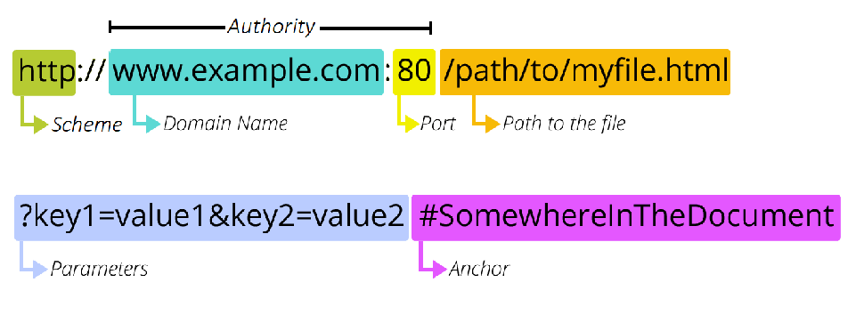

<h2> <a href="https://github.com/ECU-JF/HTML_CSS_projektarbete" style="color: Grey; text-decoration: underline;text-decoration-style: dotted;">Projektarbete i HTML & CSS - Joakim</a> </h2>

###  Index  

- [`Hemsidan`:](#hemsidan)
  - [`Bootstrap`](#bootstrap)
  - [`Figma`](#figma)
  - [`SEO`](#seo)
  - [`HTTP`](#http)
  - [`URL`](#url)
- [`Reflektioner`](#reflektioner)
  - [`Boostrap`](#boostrap)
  - [`Javascript`](#javascript)
- [Links](#links)

 

<webpage style="color:grey">

## `Hemsidan`:

- Webbplatsen ska vara sökmotorsoptimerad (semantisk HTML mm.), och ni ska tillsammans i gruppen välja och jobba med 2 till 3 nyckelord på varje sida. (Mål 5 & 2)

Har inte gjort detta ännu!

### `Bootstrap`

Denna bootstrap har jag använt mig har, har dock inte kollat vad allt gör, men de är de som påverkar mina blog-cards och navigeringsknappar mest. 

*https://cdn.jsdelivr.net/npm/bootstrap@4.6.1/dist/css/bootstrap.min.css*
### `Figma`

Bilden visar både en desktop och hur den ser ut på en mobil.

- [Index](#index)

  ### `SEO`

  - Skriv vilka nyckelord ni valde och vad du gjort för SEO på ditt ansvarsområde. (Mål 6)

  Detta och sökmotorsoptimerad är ej gjord.

  ### `HTTP`

> HyperText Transfer Protocol

I bilden ovan beskrivs ett flöde av information som hämtas, dessa adresser är http som innehåller iformation. Detta sker upprepade gånger enligt listan under namn. Varje moment går på några få millisekunder.

Den hade börjat på index.html och här finns information till sidan om vad den skall göra sedan, vad som skall begäras in.

Varje bit som hämtas använder sig av metoden GET. Om detta går som de skall så får vi tillbaka en statuskod 200. Detta betyder att vår begäran fungerat som den skall.
Detta upprepas då på allt som just denna sidan innehåller, och i mitt fall hade nästa steg varit boostrap.min.css.

Information som kan finnas på en index sida i sin head kan beskriva t ex om vi behöver hämta en link för en bild, css, js osv.

- [Index](#index)

### `URL`

> Uniform Resource Locator

När vi går genomm in bild så ser vi att URL innehåller olika delar. Så skall försöka förklar dem bit för bit. Kommer använda följaden för att förklara lite.

_https://www.games-workshop.com/en-SE/The-Dark-Lord-Sauron_

**`Scheme/Protocol`**

Detta är vad som beskriver vad det är för typ av adress. HTTP är den vanligaste tillsammans med HTTPS, den senare används när det krävs mer säkerhet. Detta döljs ofta i webläsaren för att undvika lite text och göra det lättare för användaren.

**`Domain Name`**

Sedan har vi **www.games-workshop.com** är då domännamnet, detta beskriver ofta vilket företag eller person som driver sidan.

**www** är en subdomain som också den döljs på sidor då det är den absolut vanligaste. Men det kan också finnas t ex accounts.xyz.com där den första biten då måste inkluderas och tar dig troligen till en användarsida. Slutet har vi **.com** som i detta fallet är en top-domän.

**`Port`**

Porten används som en identifiering över vilken typ av service/applicering serverna använder. Porten är inte nödvändig och hoppas över om webservern anväder sig av standard portarna för HTTP(80) och HTTPS(443).

**`Path to file`**

En typ av hiearkisk struktur som beskriver vart en resurs är lokaliserat på servern. den beskriver för servern vart denne resurs finns och vad den heter.

**`Parameter`**

Denna delen pekar din browser till en specifik del av sidan. Just nu har inte min adress något som börjar med ? Men vi har i alla fall en del som pekar på att ta oss till den Svenska versionen av sidan.

**`Anchor`**

Sista delen pekar på en specifik sak på den Svenska sidan, som kanske vill visa ett speciellt plag i en sida full av tröjor.

- [Index](#index)

</webpage>

<reflections style="color:pink">

## `Reflektioner`

Detta är en otroligt svår bit denna gången. Var så många nya saker och något vi gjorde tidigt var att ge oss en generös tidsplan med mycket luft innan vår deadline. Vi valde att göra en skiss lite snabbt på en gemensam header och nav-bar samt något utkasst på färger så vi sedan kunde jobba både på egen hand och tillsammans.

Jag började sedan googla runt lite för att titta på olika desings för bloggar, jag tittade på olika boostrap paket och valde i slutet en som jag tycker om. Att sedan använda mig av developertool var otroligt lärorikt. att gå in i det som autogenererats och kolla på vad olika delar heter, att sedan kunna manipulera dessa i CSS. Att kunna lägga min egen desing ovanpå en befintlig boostrap, att styla den efter vårt gemensamma men också mitt eget.

Sedan genom att kunna ta reda på vad en sak heter så kunde jag t ex återanvända dessa funktioner och desinger i mina länkar som klickar mig vidare bland bloggar.

### `Boostrap`

För mig är det viktigt att det är en tydlig enkel struktur, med enkla länkar, skall kunna gå tillbaka till valfri sida från varje plats för att enkelt navigera runt.

Sedan när jag väl började jobba Självständigt reflektera över och kritiskt granska de valda lösningarna i projektet gällande design och wireframes, HTML, CSS, samt Bootstrap.

### `Javascript`

Detta är inget krav i denna kursen, men vissa saker som vi kanske kunnat göra i CSS som t ex sticky navbar, men det kändes kul att prova lite inför nästa kurs. Det som är script i mitt fall är navbaren och dropdown texten på mina bloginlägg. 

[Index](#index)

Inlämning

1. En i gruppen forkar inlämningsrepon i början. Alla andra sammarbetar sen på forken.

2. I slutet, gör PR till upstream.

3. Skicka in på PingPong Gruppprojekt:

   - Varje person lämnar in en zip av repon med all versionshistorik
   - Länkar till projektet på GitHub

4. Skicka in på PingPong Rapport:
   - Varje person lämnar in sin egna rapport (pdf, eller zip med md och tillhörande bildlänkar)
   - Länkar till rapporten på GitHub

> Täckta kursplansmål:
>

> 3. Ge enklare exempel på sökmotoroptimering

> 5. Tillämpa HTML-strukturer för att bättre påverka sökoptimering.
> 6. Motivera valda lösningar för en webbsidas uppbyggnad och struktur.

</reflections>

## Links

https://github.com/ECU-JF/HTML_CSS_projektarbete - Git Projektet

https://github.com/ECU-JF/HTML_CSS_projektarbete/tree/master/blog - Min del

https://github.com/ECU-JF/HTML_CSS_projektarbete/blob/master/blog/rapport/joakimsRapport.md - Denna rapporten på git
