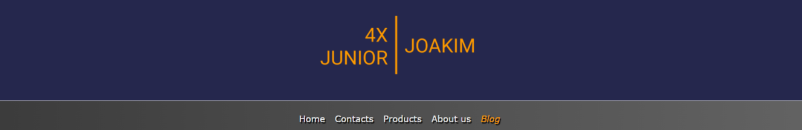
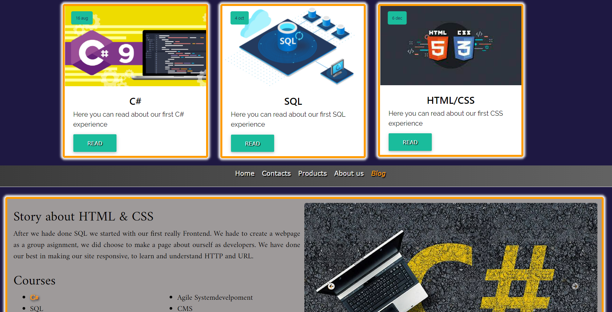

<h2> <a href="https://github.com/ECU-JF/HTML_CSS_projektarbete" style="color: Grey; text-decoration: underline;text-decoration-style: solid;">Projektarbete i HTML & CSS - Joakim</a> </h2>

### `Index`

---
- [`Hemsidan`](#hemsidan)
  - [`Bootstrap`](#bootstrap)
  - [`Figma`](#figma)
  - [`SEO`](#seo)
  - [`HTTP`](#http)
  - [`URL`](#url)
    - [_`Scheme/Protocol`_](#schemeprotocol)
    - [_`Domain Name`_](#domain-name)
    - [_`Port`_](#port)
    - [_`Path to file`_](#path-to-file)
    - [_`Parameter`_](#parameter)
    - [_`Anchor`_](#anchor)
- [`Reflektioner`](#reflektioner)
  - [`Bootstrap`](#bootstrap-1)
  - [`Javascript`](#javascript)
  - [`Motiveringar`](#motiveringar)
  - [`Design`](#design)
- [Links](#links)

---

<webpage style="color:grey">

## `Hemsidan`
### `Bootstrap`

Denna bootstrap har jag använt mig har, har dock inte kollat vad allt gör, men de är de som påverkar mina blog-cards och navigeringsknappar mest. 

*https://cdn.jsdelivr.net/npm/bootstrap@4.6.1/dist/css/bootstrap.min.css*

---

### `Figma`

Bilden visar både en desktop och hur den ser ut på en mobil.


[Index](#index)

### `SEO`

  ```HTML
  <meta
    name="keywords"
    content="HTML, CSS, JavaScript, Programmering, Programming Lead Tech, Programmers, Employ, Julbord, Consults, IT, IT-konsult"
  />
  ```
---
### `HTTP`

> HyperText Transfer Protocol


I bilden ovan beskrivs ett flöde av information som hämtas, dessa adresser är http som innehåller information. Detta sker upprepade gånger enligt listan under namn. Varje moment går på några få millisekunder.

Den hade börjat på index.html och här finns information till sidan om vad den skall göra sedan, vad som skall begäras in.

Varje bit som hämtas använder sig av metoden GET. Om detta går som de skall så får vi tillbaka en statuskod 200. Detta betyder att vår begäran fungerat som den skall.
Detta upprepas då på allt som just denna sidan innehåller, och i mitt fall hade nästa steg varit boostrap.min.css.

Information som kan finnas på en index sida i sin head kan beskriva t ex om vi behöver hämta en link för en bild, css, js osv.

[Index](#index)

---
### `URL`

> Uniform Resource Locator


När vi går genom in bild så ser vi att URL innehåller olika delar. Så skall försöka förklara dem bit för bit. Kommer använda följden för att förklara lite.

_https://www.games-workshop.com/en-SE/The-Dark-Lord-Sauron_

#### _`Scheme/Protocol`_

Detta är vad som beskriver vad det är för typ av adress. HTTP är den vanligaste tillsammans med HTTPS, den senare används när det krävs mer säkerhet. Detta döljs ofta i webläsaren för att undvika lite text och göra det lättare för användaren.

#### _`Domain Name`_

Sedan har vi **www.games-workshop.com** är då domännamnet, detta beskriver ofta vilket företag eller person som driver sidan.

**www** är en subdomän som också den döljs på sidor då det är den absolut vanligaste. Men det kan också finnas t ex accounts.xyz.com där den första biten då måste inkluderas och tar dig troligen till en användarsida. Slutet har vi **.com** som i detta fallet är en top-domän.

#### _`Port`_

Standard portarna för HTTP(80) och HTTPS(443). Dessa skrivs oftast inte ut, men det är de som används för att identifiera vilken service och applicering som servarna använder. 

#### _`Path to file`_

Detta referrar till vart något exakt finns analogt på server. En post, en fil, en liknande. Ofta då finns i den underliggande strukturen av en websida. Detta användes mer för och är idag en är det snarare hanterat av en Web Server som inte har någon fysisk plats. 

#### _`Parameter`_

Denna delen pekar din browser till en specifik del av sidan.Text en vissa gata i en Ort, där det finns flera hus. 

#### _`Anchor`_

Sista delen som exempelvis pekar på en specifik plats inom den gatan ovanför. Det är lite luddigt med parameter och ankare då det devis gör samma saker. 

[Index](#index)
 
---

## `Reflektioner`

Detta är en otroligt svår bit denna gången. Var så många nya saker men något vi gjorde tidigt var att ge oss en generös tidsplan med mycket luft innan vår deadline. 

Vi valde att göra en skiss lite snabbt på en gemensam header och nav-bar samt något utkast på färger så vi sedan kunde jobba både på egen hand och tillsammans.

Jag började sedan googla runt lite för att titta på olika designs för bloggar, jag tittade på olika boostrap paket och valde i slutet en som jag tycker om. Att sedan använda mig av developertool var otroligt lärorikt. att gå in i det som autogenererats och kolla på vad olika delar heter, att sedan kunna manipulera dessa i CSS. Att kunna lägga min egen design ovanpå en befintlig boostrap, att styla den efter vårt gemensamma men också mitt eget.

Att kunna ta reda på vad en sak heter så kunde jag t ex återanvända dessa funktioner och designer i mina länkar som klickar mig vidare bland bloggar.

---

### `Bootstrap`

För mig är det viktigt att det är en tydlig enkel struktur, med enkla länkar, skall kunna gå tillbaka till valfri sida från varje plats för att enkelt navigera runt.

Så även om boostrapen jag använde i första hand var för mina blogg-kort. så tog jag dess knappar igen till att navigera mellan inläggen.

Sedan när jag väl började jobba Självständigt reflektera över och kritiskt granska de valda lösningarna i projektet gällande design och wireframes, HTML, CSS, samt Bootstrap.

---

### `Javascript`

Detta är inget krav i denna kursen, men vissa saker som vi kanske kunnat göra i CSS som t ex sticky navbar, men det kändes kul att prova lite inför nästa kurs. Det som är script i mitt fall är navbaren och dropdown texten på mina blogginlägg.

---

### `Motiveringar`

Väldigt mycket av mina personliga motiveringar till varför vi har t ex en ganska simpel men tydlig navbar är att idag upplever jag många sidor vara lite för plottriga med en massa häftiga effekter som nu går att göra. Denna är stilren och enkel, tdylig.



Rätt sent satt jag med Johan och snackade lite om design och frågade om vi kunde ändra länkarna till samma färg som loggan när du hovrar över samt att vi kunde ha den aktiva sidan markerad. Precis som att loggan Johan gjorde visar vems sida du är inne på, små enkla detaljer som gör mycket. 

---

### `Design`

Sedan kände jag att vi tidigt hittade lite färger att jobba runt, när vi då fick till den så har jag försökt återanvända denna här och där för att få det att kännas sammanhängande. Både min blogcontent och mina blog cards t ex fick samma orange border samt ett lite vitt glow runt för att kännas mjukt och ändå höra ihop. 



Länge hade jag vitt runt blogg men valde att köra på detta. Så kort och gott är det i mitt fall mest små ändringar här och där, prova olika funktioner. Efter att jag till sist fått det med att få min bild att funka i samma container som texten och att den wraps runt den så började jag jobba mer med media querys. 

Tycker det är viktigt att designen inte förstörs för att du sitter på en mobil men är nöjd med hur den beter sig när olika användare ser på den.

I övrigt så har CSS givit mig och Johan en hel del skratt och frustration, det märks hur det är ett språk som både utvecklas och lever, att det finns diverse olika konflikter i funktioner som gärna vill bestämma. 

Men tror att detta med Fronten passar mig på sättet en kan jobba med detaljer i pixelnivå. 

[Index](#index)

</webpage>

## Links

https://github.com/ECU-JF/HTML_CSS_projektarbete - Git Projektet

https://github.com/ECU-JF/HTML_CSS_projektarbete/tree/master/blog - Min del

https://github.com/ECU-JF/HTML_CSS_projektarbete/blob/master/blog/rapport/joakimsRapport.md - Denna rapporten på git


