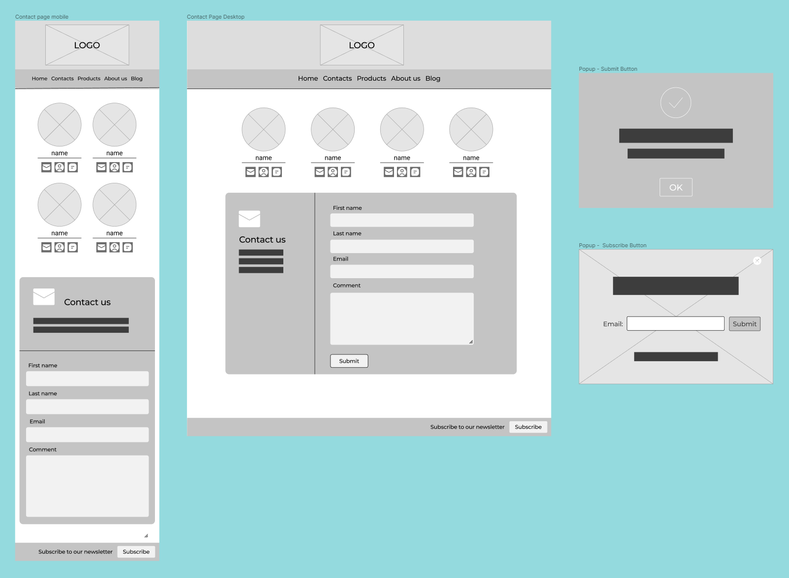
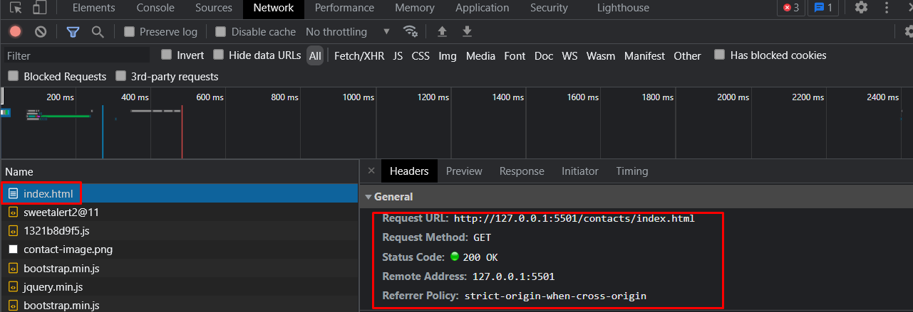
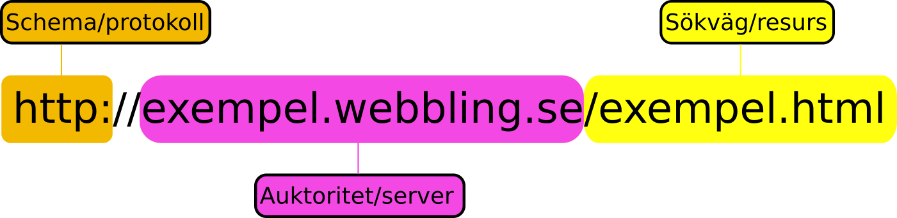

# [PROJEKTARBETE HTML & CSS](https://github.com/ECU-JF/HTML_CSS_projektarbete)

### **Inledning**
Projektets mål var att skapa en statisk hemsida där vi studenter hade startat ett konsultföretag för att sälja IT-lösningar inom webb och applikation utveckling.
Med den startpunkten kunde viskapa mallen för vår homepage tillsammans. Det gav oss en header och navigation att plocka vidare till de personliga sidorna. Min uppgift blev att utforma sidan `Contacts` som innehåller informationen och formulär för att contacta företaget eller de anställda direct.

  

#### **Innehållsförtekning**:

- [PROJEKTARBETE HTML & CSS](#projektarbete-html--css)
    - [**Inledning**](#inledning)
      - [**Innehållsförtekning**:](#innehållsförtekning)
  - [**Wireframe** - Contatcs page](#wireframe---contatcs-page)
  - [**SEO** - Search Engine Optimization](#seo---search-engine-optimization)
  - [**HTTP** - Hypertext Transfer Protocol](#http---hypertext-transfer-protocol)
  - [**URL** - Uniform Resorce Locators](#url---uniform-resorce-locators)
    - [**Schema**](#schema)
    - [**Auktoritet**](#auktoritet)
    - [**Sökväg**](#sökväg)
  - [**Utvärdering** - Projektarbete](#utvärdering---projektarbete)

  

## [**Wireframe**](https://en.wikipedia.org/wiki/Website_wireframe) - Contatcs page 
<!-- Ha med Wireframen du använde för ditt ansvarsområde (png/bmp/jpg/pdf) (Mål 7) -->

"_Började_"  med att skapa en wireframe skiss i Figma med alla element för att visualisera hur den färdiga produkten skulle se ut både för desktop och mobil.

  

---
## [**SEO**](https://en.wikipedia.org/wiki/Search_engine_optimization) - Search Engine Optimization
<!-- Skriv vilka nyckelord ni valde och vad du gjort för SEO på ditt ansvarsområde. (Mål 6) -->

En sida som **Contacts** kan vara svårt att fylla med massa text och beskrivning av versamheten som innehåller sökord/nyckelord utan att det känns missplacerat. Därför fokuserades det istället på metadata i `<head>` med `keywords` så som: webbutvecklare, dalarna, IT-konsult och sedan en `description` som beskriver företaget och dess produkter. 

  

---
## [**HTTP**](https://developer.mozilla.org/en-US/docs/Web/HTTP/Overview) - Hypertext Transfer Protocol
<!-- Använd bilder från Inspector verktyget och förklara i grova lag hur webläsaren använder HTTP för att besöka just din hemsida. (Mål 2) -->

Genom att använda webbläsarens inbyggda verktyg *Developer tools* och navigera oss till fliken *Network* kan vi se hela förloppet som sker i och med att vi skriver in hemsidans URL *(http://127.0.0.1:5501/contacts/index.html)* och trycker enter.

- Vi skickar en GET `index.html`, sedan får vi svaret 200 OK (request has succeeded) vilket betyder att resursen blivit hämtad och läses av webbläsare.

- Webbläsaren läser igenom `index.html` filen och ser att det finns kod som vill hämta in fler objekt till webbläsare, exempelvis länkar till externa tjänster, andra filer i projktet så som CSS, JS och bilder. Snabbt läses alla filer igenom och hämtas till webbsidan tills det är klart.

- Allt detta sker på ett par hundra millisekunder i detta fall och sidan vissas i sin helhet om allt gått bra och webbläsaren stödjer all kod. 

 

  

---
## [**URL**](https://developer.mozilla.org/en-US/docs/Learn/Common_questions/What_is_a_URL) - Uniform Resorce Locators

<!-- Förklara varför just den URL som används i HTTP anropet ovan används. (Använd ord som: schema/protokoll, auktoritet/server/domän, sökväg/resurs) (Mål 2) -->
 

    Min URL: http://127.0.0.1:5501/contacts/index.html

 

 

### **Schema**
Första delen i en URL kallas **scheme**, den indikerar vilken typ av protokoll som webbläsare måste använda vid förfråga att komma åt en webbsida (i detta fall). I sin enkelhet är ett protokoll en standard/regelsamling som  beskriver hur data ska paketeras, addresseras, skickas, "ruttas" och tas emot.

I min URL ovan används HTTP (Hypertext Transfer Protocol) vilket är en av de vanligaste protokollen för webbsidor. 
Några andra vanliga protokoll som används av applikationer är HTTPS, FTP, IMAP, DNS, SMTP, TLS/SSL. 
[**wiki**](https://en.wikipedia.org/wiki/Internet_protocol_suite)

 

### **Auktoritet**
Sedan kommer den del som kallas för **Authoity**, denne innehåller både en `Domain` och en `Port`. 

- Domännamet identifierar vilken dator eller webbserver förfrågan ska hämtas ifrån. Bakom domännamnet döljer sig en [IP-adress](https://en.wikipedia.org/wiki/Internet_Protocol), men då det kan vara svårt för människor att komma ihåg massa långa siffer kombinationer *(64.233.160.0:17)* översätter man IP-addressen till ett domännamn som exempelvis *www.google.se* vilket är lättare att komma ihåg.

- Porten används som en identifiering över vilken typ av service/applicering serverna använder. Porten är inte nödvändig och hoppas över om webservern anväder sig av standard portarna för HTTP(80) och HTTPS(443).

I min URL kan vi se IP-addressen `127.0.0.1` och porten `5501` det är stadardvärden i configurationsfil för en plugin som heter *Live Server* i Visual studio code. Live server skapar en lokal server på min dator för att vissa hemsida som är under uppbyggnad/utveckling.

### **Sökväg**

En typ av hiearkisk struktur som beskriver vart en resurs är lokaliserat på servern. den beskriver för servern vart denne resurs finns och vad den heter.

I mitt fall kan vi se `/contacts/index.html` vilket säger att i rotkatalogen finns mappen `contacts` i mappen finns en fil som heter `index.html` hämta den. 
Om filen skulle saknas skicka det tillbaka ett felmeddelande.

  

---
## [**Utvärdering** - Projektarbete](../index.html)

<!-- Självständigt reflektera över och kritiskt granska de valda lösningarna i projektet gällande design och wireframes, HTML, CSS, samt Bootstrap. -->

---
> Johan Fahlgren, 2022-01-06