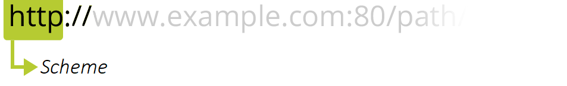

## **Summary**
We have made our website  that  is responsive  with desktop  and smartphone. We have done these  through html,css, bootstrap javaScriptcode(not everyone) and media query.We have common styling that all sides use. Also every page has unique stylings that has done each developer.We have a common styling with a recurring theme in our own desing.  We use At least one Bootstrap snippet or component tested per person The website has search engine optimized (semantic HTML etc.), and we must together in the group choose and work with 2 to 3 keywords on each page.
## **Wireframe** -(Product and productDetails page)
I used Figma to creating a wireframe sketch with all the elements to visualize what the finished product would look like for both desktop and mobile. Also i sketched individiul component of both Product and productDetails pages. Image is geiven below:

  
 # **Search engine optimization (SEO)**
Search engine optimization. It is a set of rules for optimizing our website so that it can achieve higher rankings in search engines’ organic results. It’s the process to follow to increase the visibility of our website in search engines and get more traffic.My product page has search engine That is to help you understand what users are searching for online so that you can create high-quality content to satisfy their intent. The second is to help you create a website that search engines can find, index, and understand its content.In addition, It  increases  the quality of our website by making it user-friendly, faster, and easier to navigate.
  

 # **http**
HTTP is a protocol for fetching resources such as HTML documents. It is the foundation of any data exchange on the Web and it is a client-server protocol, which means requests are initiated by the recipient, usually the Web browser. A complete document is reconstructed from the different sub-documents fetched, for instance, text, layout description, images, videos, scripts, and more.
By using the browser's built-in tool Developer tools and navigating to the Network tab, we can see the entire process that takes place by entering the website's URL (http://127.0.0.1:5501/products/index.html) 

Firsy we need request a GET index.html, then we get the answer 200 OK that is responses. Its  means that the resource has been downloaded and read by a browser.The browser reads through the index.html file and sees that there is code that wants to download more objects to the browser, such as links to external services, other files in the project such as CSS, JS and images. All this happens in a couple of hundred milliseconds in this case 

  

 # **URL**
URL stands for Uniform Resource Locator. A URL is nothing more than the address of a given unique resource on the Web. In theory, each valid URL points to a unique resource. Such resources can be an HTML page, a CSS document, an image, etc.
my URL: http://127.0.0.1:5501/products/index.html where  127.0.0.1 is Local IP and 5501 is a port number.

  

# **Scheme**
The first part of the URL is the scheme, which indicates the protocol that the browser must use to request the resouce (a protocol is a set method for exchanging or transferring data around a computer network). Usually for websites the protocol is HTTPS or HTTP (its unsecured version). Addressing web pages requires one of these two, but browsers also know how to handle other schemes such as mailto: (to open a mail client), so don't be surprised if you see other protocols.
My Hypertext Transfer Protocol which is one of the most common protocols for web pages. Some other common protocols used by applications are HTTPS, FTP, IMAP, DNS, SMTP, TLS / SSL. Wiki

  

# **Authority**

Next follows the authority, which is separated from the scheme by the character pattern ://. If present the authority includes both the domain (e.g. www.example.com) and the port (80), separated by a colon:The domain indicates which Web server is being requested. Usually this is a domain name, but an IP address may also be used 
The port indicates the technical "gate" used to access the resources on the web server. It is usually omitted if the web server uses the standard ports of the HTTP protocol to grant access to its resources. Otherwise it is mandatory.
  

# **Path**
/path/to/myfile.html is the path to the resource on the Web server. In the early days of the Web, a path like this represented a physical file location on the Web server. Nowadays, it is mostly an abstraction handled by Web servers without any physical reality.
  

  # **Reflection of Project**

Where I work with the group project to determine what goals the new website needs to fulfill.Once we know the site's goals, we can define the scope of the project. I.e., what web pages and features the site requires to fulfill the goal, and the timeline for building those out.
With the scope well-defined, we can start digging into the sitemap, defining how the content and features we defined in scope definition will interrelate. Good wireframes creation solve real problems and lead to strong products. From writing out the scenario to gathering inputs, here is a proven path to a great website or app. My wireframes are too designed, it means that too much time is being taken up by them. Remember, they’re only there to help me map out the very basic flow of my webpages, so it shouldn’t be a huge step in the process.

Then  we have a bigger picture of the site in mind, we can start creating my content for the individual pages, always keeping search engine optimization (SEO) in mind to help keep pages focused on a single topic. It's vital that I have real content to work with for our next stage.

With the site architecture and some content in place, we can start working on the visual brand. Depending on the client, this may already be well-defined, but we might also be defining the visual style from the ground up. 

HTML is widely used and every browser supports HTML Language.It Easy to learn and  HTML is light weighted and fast to load.HTML also allows  us to utilization of templates, which makes our designing a webpage easy because HTML has many tag and attributes which can short ours line of code.But its true that It cannot produce us dynamic output alone, since it’s a static language.Sometimes my making  structure of HTML documents becomes tough to understand to intregrate with others .It is the time consuming as the time it consume to maintain on the colour scheme of a page and to make lists, tables and forms. Even  security features offered by HTML are limited.

The main benefit we go from  CSS is that style is applied consistently across a number of ours web pages. One command line can control several areas at one time, which is quite advantageous if there are changes that need to be made. we only need to alter one thing and the rest will follow. Because we don’t have to change each page one at a time, web designers can be very efficient in creating and changing a website with only a few lines of code. We also realized that without good CSS its realy hard to  improved website speed.

We faced a problem With CSS, what works with one browser may not always work with another. We suppose to do test for compatibility, running the program across multiple browsers before a website is set live but we dont. Because this bug was visible in very few cases.

Recently, Bootstrap gained much popularity as the number one Front-end framework among web developers. Bootstrap helps us to creating mobile-friendly websites.But someimes we were confused because  everything built with Bootstrap will have very similar looks. Thats in some cases we override and modify style sheets manually

After Intregrating all ours codes , we've got all our pages and defined how they display to the site visitor, so it's time to make sure it all works

